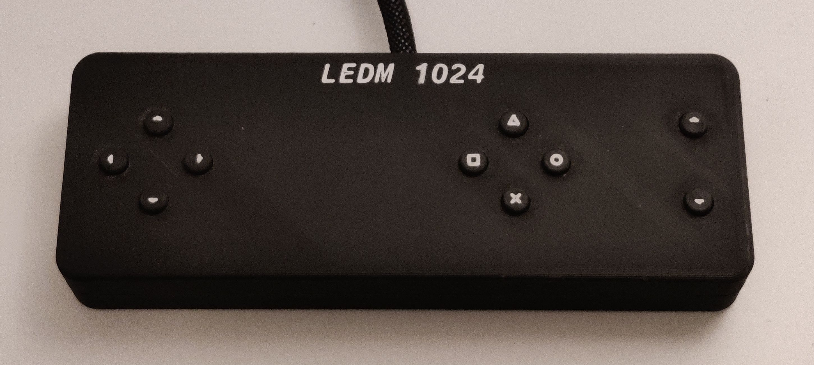

# LEDM1024

The LEDM1024 is a 32x32 LED screen made from scratch using an Atmega328p as the processor.

## Applications

The available applications are John Conway's Game of Life, Snake and Pong.

John Conway's Game of Life has a random initial state and evolves until the state becomes stationary or starts oscillating between two states. After this, the app refreshes and a new random initial state is generated. Using the knob on the side panel, the frame rate can be adjusted.

To play Snake, the external controller is needed. The highscore is displayed on the menu screen and updates automatically when this score is exceeded. Normal Snake rules apply, so you lose when you hit the wall or the tail. Each food piece you consume, increases the score by 1. If the frame rate is high enough, the score is increased by 5.

To play Pong, the external controller and two players are needed. One player uses the leftmost up and down buttons and the second player uses the rightmost up and down buttons on the controller. Again, the knob on the side panel can be used to change the frame rate.

## Electronics

### Processor

The processor is an Atmega328p (Arduino Uno chip). To control the 1024 LED's, 10 74HC595 shift registers are used together with multiplexing. Using these shift registers, the Atmega processor can control 80 separate pins using only four pins on the processor itself (clock, data, latch, and enable). The 32x32 LED grid is internally connected as if it where a 16x64 LED grid, resulting in 80 pins needed for multiplexing.

When multiplexing, each row of LED's is turned on separately. This is done at a frequency of about 8kHz to eliminate flickering. Because each row is only turned on 1/16 of the time, the perceived brightness of the LED's is also 1/16 of the normal brightness. This is the reason why the LED's are connected in a 16x64 grid, because a 32x32 grid would result in a brightness level of 1/32, which would be too low. Changing the layout to a 8x128 grid would increase the brightness to 1/8, which is better than 1/16, but this would increase the total amount of current that runs through one row. The operating current of each LED is 20mA, having 64 LED's in one row results in a total current per row of 1.28A. Compared to 2.56A in a 8x128 grid layout, a 16x64 layout was chosen as trade-off between brightness and total current.

### Controller

To play Snake and Pong, an external controller is needed to allow for more functionality. The external controller has 10 buttons and the side panel has four plus a rotating knob. Connecting these buttons in the conventional way, 15 pins would have to be used. The cable connecting the external controller would also have to house 12 separate cables (10 for the buttons, one ground, and one signal line to detect if the controller is plugged in). Because this kind of cable is not readily available, button multiplexing was used. Button multiplexing differs from LED multiplexing in that specific valued resistors are used to create an analog voltage signal depending on which buttons are pressed. The image below shows a diagram for multiplexing four buttons.

After a lot of trial and error, these resistor values were chosen to maximise the voltage difference between different button pressed configurations. All the possible values are stored in a look up table. The values are ordered in ascending order, which has to convenient result that the binary represenation of the value position in the list corresponds to which buttons are pressed.

| Analog signal (0 - 255) | S1 | S2 | S3 | S4 |
|:-----------------------:|:--:|:--:|:--:|:--:|
|            0            |  0 |  0 |  0 |  0 |
|            17           |  0 |  0 |  0 |  1 |
|            34           |  0 |  0 |  1 |  0 |
|            48           |  0 |  0 |  1 |  1 |
|            60           |  0 |  1 |  0 |  0 |
|            70           |  0 |  1 |  0 |  1 |
|            81           |  0 |  1 |  1 |  0 |
|            89           |  0 |  1 |  1 |  1 |
|            97           |  1 |  0 |  0 |  0 |
|           104           |  1 |  0 |  0 |  1 |
|           111           |  1 |  0 |  1 |  0 |
|           117           |  1 |  0 |  1 |  1 |
|           122           |  1 |  1 |  0 |  0 |
|           127           |  1 |  1 |  0 |  1 |
|           132           |  1 |  1 |  1 |  0 |
|           137           |  1 |  1 |  1 |  1 |

Using this button multiplexing, only six signal cables are needed to connect the external controller: three for all the buttons, one ground, one +5V, and one signal line. The signal line is connected to ground inside the controller such that the processor knows when the external controller is plugged in.

## Image generator

Instead of manually editing an array of 128 bytes to create images, a python program was written to make life easier. The program uses Tkinter to create a simple UI. The program displays a grid of 32x32 cells which can be turned on/off individually by clicking on them. Other buttons allow the content of the display to be moved around, cleared, and exported into an array of 64 doubles which can be copied into the images.h file of the Arduino code.

## Design

The casing is built around plywood sheet where all the LED's are mounted into. This sheet has a grid of 32x32 holes drilled and all the LED's are gluid in place. The LED leads are soldered to rails of copper wire to connect them in a grid like pattern. In the image below, the LED's are glued in place and the they are connected in rows using relatively thick copper wire to handle the current.

The columns are soldered together using thinner wire and raised above the row connections. Lastly, the rows are connected in pairs to create the 16x64 structure instead of 32x32.

All the circuit boards containing the Atmega328p and shift registers, are mounted on the solder side of this sheet, raised using standoffs (insulated with heat shrink to prevent short circuits of the underlying wires). These circuit boards all receive a power line from the processor board and the signal lines are chained through the shift registers as shown below.

